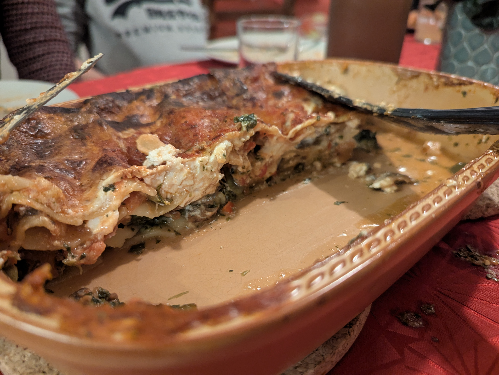

## Lasagne für 6 Personen

### Zutaten:
#### Rohe Zutaten
- 1 Aubergine
- 1 Zucchini
- 200g Pilze
- 3 Paprika
- 3 Packungen Feta
- 400g Spinat (evtl. Tiefgefroren)
- 750g gehackte Tomaten 
- 3 Becher Schmand
- Parmesan
- 4 Zehen Knoblauch
- 1 Packung Lasagneplatten
- Olivenöl
- ggf. Tomatenmark
- Wasser
- Milch

#### Kräuter
- Rosmarin
- Thymian
- Pfeffer
- Salz
- Muskat
- Gemüsebrühe
- Chili

#### Kochutensilien
- Topf
- (vorzugsweise Eckige) Auflaufform
### Zubereitung

**Topf 1**

- Den Spinat auftauen (wenn er tiefgefroren ist) und mit der halben Menge Knoblauch, Pfeffer, Salz und Muskat andünsten

**Topf 2**

- Die Pilze, Paprika, Aubergine und Zucchini klein schneiden. Zuerst die Auberginen mit viel Olivenöl anbraten, danach die anderen Gemüse dazu geben und dünsten
- Die andere Hälfte des Knoblauchs dazu geben und mitdünsten 
- Die gehackten Tomaten dazugeben und viel Rosmarin und Thymian dazugeben, das davor gemörsert oder gehackt wurde
- Ordentlich Wasser und evtl. Tomatenmark dazu geben
- 2-4 TL Gemüsebrühe dazugeben (abschmecken)
- Pfeffer, Salz und Chili dazugeben und abschmecken

**Auflaufform**

- Den Ofen auf 170 °C Umluft vorheizen
- In einer Auflaufform den Boden mit Olivenöl bedecken, die Lasagneplatten auslegen und den Spinat darauflegen. Danach das Gemüse mit einem Schaumlöffel darauf legen, damit noch Flüssigkeit übrig bleibt
- Den Schmand mit etwas Milch verlängern
- Das Milch-Schmand-Gemisch auf das Gemüse vereinzelt darauf geben und mit Feta belegen
- Dann wieder mit Lasagneplatten -> Spinat -> Gemüse -> Schmand -> Feta belegen
- Schließlich eine Lasagneplatte obendrauf legen und mit der restlichen Flüssigkeit des Gemüses bedecken, damit nichts anbrennt
- Schließlich mit Parmesan bedecken
- Im Ofen für 20 Minuten für 170 °C und dann 15 Minuten bei 160 °C backen. Mit dem Messer einstechen und ggf. die Zeit noch verlängern. Ggf. auch die Angabe auf den Lasagneplatten beachten.